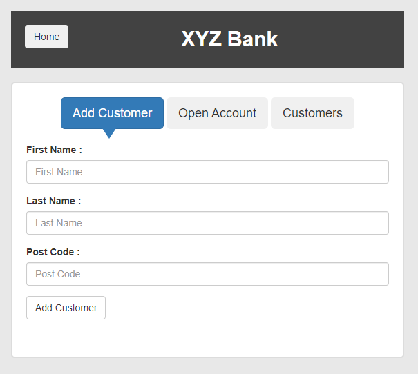
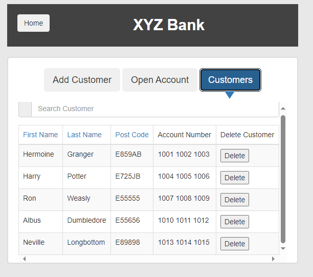
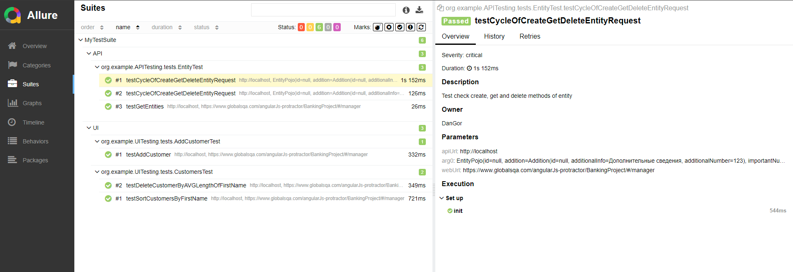

# Practice-Simbirsoft-SDET

----

Задание - протестировать функционал
1. Создание клиента
2. Сортировка клиентов по имени
3. Удаление клиента

***<p style="text-align: center;">Practice Simbirsoft-SDET  проект UI-автотестирование</p>***
-


В проекте используется Java-17, TestNG, Allure, Selenium с паттерном Page Object Model.

Команда для запуска тестов через maven:
```shell
mvn clean verify
```
В директории /target выполнить последовательно команду фреймворка Allure для визуализации отчета:
```shell
%ALLURE_HOME%\bin\allure.bat generate
%ALLURE_HOME%\bin\allure.bat open
```
<p style="text-align: center;">Тестируемая форма AddCustomer</p>



<p style="text-align: center;">Тестируемая форма CustomersPage</p>



В ходе данной работы был написан функционал для тестирования страничек.

<p style="text-align: center;">Результат работы тестов:</p>

