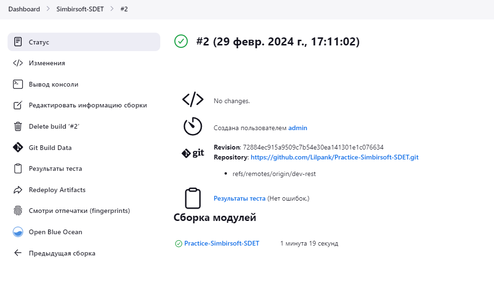

# Practice-Simbirsoft-SDET

----

В проекте используется Java-17, TestNG, Allure, Selenium с паттерном Page Object Model, Gson, Rest assured,  Docker, Jenkins.

Команда для запуска тестов через maven:
```shell
mvn clean verify
```
В директории /target выполнить последовательно команду фреймворка Allure для визуализации отчета:
```shell
%ALLURE_HOME%\bin\allure.bat generate
%ALLURE_HOME%\bin\allure.bat open
```

***<p style="text-align: center;">Задание 1 UI-автотестирование</p>***
-

протестировать функционал
1. Создание клиента
2. Сортировка клиентов по имени
3. Удаление клиента

<p style="text-align: center;">Тестируемая форма AddCustomer</p>


<p style="text-align: center;">Тестируемая форма CustomersPage</p>


В ходе данной работы был написан функционал для тестирования страничек.

***<p style="text-align: center;">Задание 2 API-автотестирование</p>***
-

В данной работе тестируется REST сервис - https://github.com/sun6r0/test-service

 <p align=center> Endpoints </p>


Команда для запуска container сервиса через:
```shell
docker-compose up -d
```

В ходе данной работы был написан функционал для тестирования REST endpoints.

<p style="text-align: center;">Результат работы тестов:</p>


 <p align=center> Результаты применения CI/CD с помощью Jenkins. </p> 



